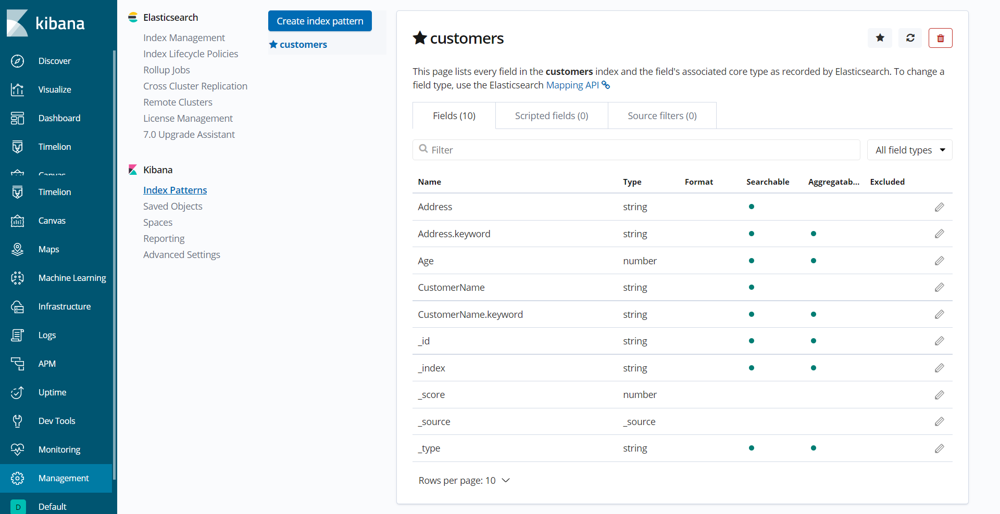

# deploy the docker

pull the docker from docker hub

```bash
docker pull gaoyuanliang/jessica_kibana:1.0.4
```

run the docker

```bash
docker run -it ^
-v "C:\Users\gaoyu\Downloads":/Downloads/ ^
-p 0.0.0.0:9466:9466 ^
-p 0.0.0.0:5145:5145 ^
gaoyuanliang/jessica_kibana:1.0.4 &
```

enter the docker

```
docker ps

docker exec -it 0940e37e5242 bash
```

# elasticsearch

## start the service

```python
import jessica_es

es_session = jessica_es.start_es(
	es_path = "/jessica/elasticsearch-6.7.1",
	es_port_number = "9466")
```

check the service at http://0.0.0.0:9466

## ingest data to es index

```python
jessica_es.insert_doc_to_es(
	es_session,
	es_index = 'customers',
	doc_dict = {'CustomerName':'Alfreds Futterkiste',
		'Address':'Obere Str. 57',
		'Age':26},
	doc_id = '1')
```

view the data of index at http://0.0.0.0:9466/customers/_search?pretty=true


view the indeces at Elasticsearch at http://0.0.0.0:9466/_cat/indices?v

## ingest a json file of data to an es index

```python
jessica_es.ingest_json_to_es_index(
	json_file = 'data_sample.json',
	es_index = "customers",
	es_session = es_session,
	document_id_feild = 'CustomerName',
	)
```

## query from index

```python
for r in jessica_es.search_doc_by_match(
	index_name = 'customers',
	entity_name = 'Alfreds Futterkiste',
	field_name = 'CustomerName',
	es_session = es_session,
	return_entity_max_number = 1,
	return_entity_min_score = 0):
	print(r)
```


# kibana

## start kibana

```python
jessica_es.start_kibana(
	kibana_port_number = "5145",
	es_port_number = "9466",
	)
```

view kibana dashboard at http://0.0.0.0:5145



if blocked, run the commend in kibana

```
PUT .kibana/_settings
{
	"index": {
	"blocks": {
		"read_only_allow_delete": "false"
		}
	}
}
```

# todo list

1. build api for batch data ingestion from json file or folder -- single json file ingestion complete, folder of json files pending
